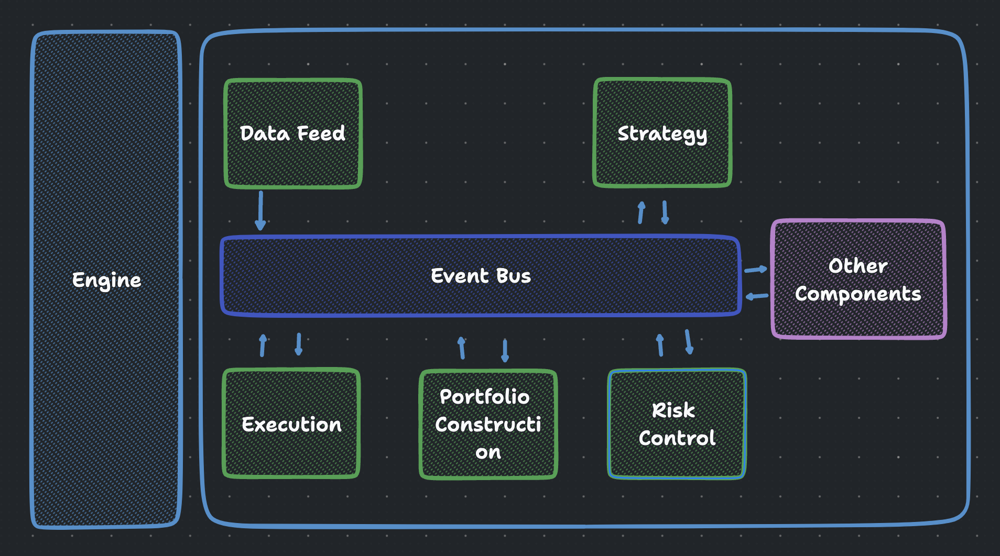
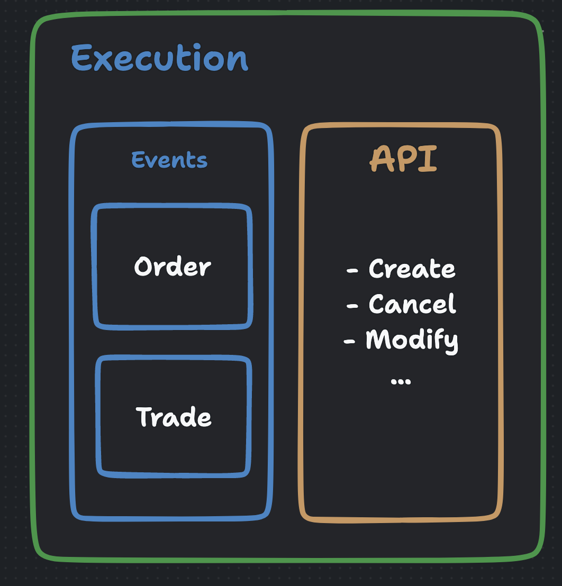

# 事件驱动系统化交易框架

This is mainly an educational implementation. The goal is to explain the core 
concepts of event-driven trading system as clear as possible.

But with few more refactor and implementation of the interface, this is a working
framework to do backtesting and live trading.

这是一个教育版本的事件驱动系统化交易框架。从一个最小化的框架（100+行代码）开始，逐步构建完整的
框架。每一次更新，我会采用一个 git tag 做标记，比如 `v1`,`v2` 这种，这样本一个版本都可以
查阅跟前一个版本的区别和联系。

可以通过 `https://github.com/wangzhe3224/simple/compare/{替换成某个tag2}...{tag号1}`
查看不同版本之间的区别。

每一个版本，我会尽量配一个视频讲解：

- [Youtube](https://www.youtube.com/watch?v=wm7QLlzgo2M&list=PL5ETbHWvsj-FJUbOyDHHqu6IyK6Sd17Ba&index=13)
- [B站](https://space.bilibili.com/414096658/channel/collectiondetail?sid=91587)

- [事件驱动系统化交易框架](#事件驱动系统化交易框架)
  - [路线图](#路线图)
  - [V1 Bare Minimal](#v1-bare-minimal)
  - [V2 Add Execution](#v2-add-execution)
  - [V3 Make project a proper Python project structure](#v3-make-project-a-proper-python-project-structure)
  - [V4 Data - Util](#v4-data---util)
  - [Buy me a coffee?](#buy-me-a-coffee)

## 路线图

- [x] v1 100行代码最小化框架
- [x] v2 200行代码增加执行模块接口
- [x] v3 改进项目的组织架构
- [ ] 数据
    - [ ] 加密货币分时历史数据
    - [ ] 分式数据模块
- [ ] 回测
    - [ ] 策略接口和示范
    - [ ] 回测模拟执行模块
    - [ ] 加密货币分时历史数据回测和分析

## V1 Bare Minimal

100 行代码 + 1 张图，理解系统化交易事件驱动框架。

量化交易开源社区绝大部分框架都是采用了事件驱动设计模式，比如：

- vnpy
- backtrader

主要的组成部分：

- Engine *
- EventBus *
- DataFeed *
- Strategy *
- Execution
- Portfolio
- Risk
- Other

[>> 视频讲解 v1](https://www.youtube.com/watch?v=wm7QLlzgo2M&t=1s)

## V2 Add Execution

200 + 行代码，加入执行模块。

Check git tag v2 to see the code. 

[>> 视频讲解 v2](https://www.youtube.com/watch?v=Iy50u3qFYdc)

## V3 Make project a proper Python project structure

- Add poetry package management
- Create module properly
- Separate data model and component
- Separate example code with source code

[Diff v2 vs v3](https://github.com/wangzhe3224/simple/compare/v2...v3)

[>> 视频讲解 v3 <<](https://www.youtube.com/watch?v=5v25dblc2E0)

## V4 Data - Util

这个部分为我们的回测数据做准备：

- Binance 批量下载不同粒度的分时数据
- 处理分时数据
- 基本的数据检查

**参考链接**：

- [Binance History Data](https://data.binance.vision/?prefix=data/spot/monthly/klines/BTCUSDT/1m/)
- [Binance API Doc](https://binance-docs.github.io/apidocs/spot/en/#kline-candlestick-data)

[Diff v4](https://github.com/wangzhe3224/simple/compare/v3...v4)

[>> <<]()

## Buy me a coffee?

    <table>
	    <tr>
            <td style="padding:10px">

            </td>
            <td style="padding:10px">

            </td>
        </tr>
    </table>

